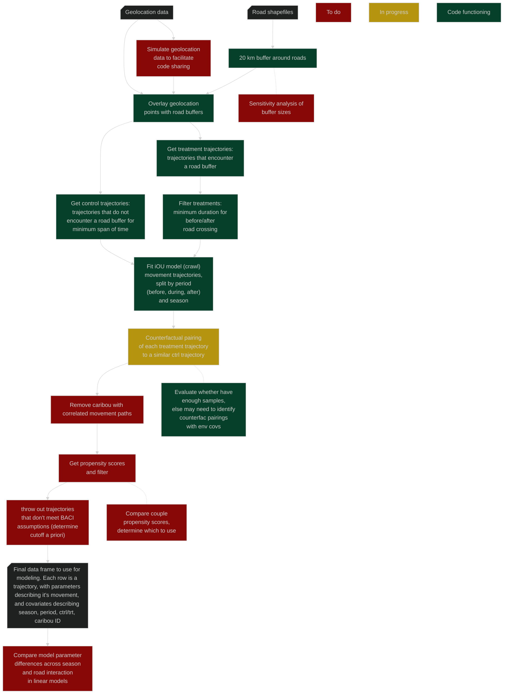

```{r echo=FALSE, include=FALSE}
#Sys.getenv("PATH")
#Sys.setenv(PATH=paste("/run/user/1001/fnm_multishells/449478_1771356157082/bin", Sys.getenv("PATH"), sep=":"))
#Sys.getenv("PATH")
```


```{bash include=FALSE, echo=FALSE}
export CHROME_DEVEL_SANDBOX=/opt/google/chrome/chrome-sandbox
mmdc -i ./Documents/mvBACIpipeline.mmd -o ./Documents/mvBACIpipeline.png -t dark -b 000000 -w 1000 --scale 2
```

```{r setup, include=FALSE}
knitr::opts_chunk$set(echo = TRUE)
#library(DiagrammeR)
```

## Overview

## Pipeline
```{r figurename, echo=FALSE, dpi=300}

```
