```{bash include=FALSE, echo=FALSE}
export CHROME_DEVEL_SANDBOX=/opt/google/chrome/chrome-sandbox
mmdc -i ./Documents/mvBACIpipeline.mmd -o ./Documents/mvBACIpipeline.svg -t dark -b 333333 --scale 2
```

```{r setup, include=FALSE}
knitr::opts_chunk$set(echo = TRUE)
```

## Overview
The purpose of this pipeline is to conduct an analysis that evalutes caribou movement before and after road interacations using a BACI (before-after-control-impact) framework, with counterfactual pairings of control (no road interaction) and treatment (interaction with road) trajectories.

## About this repo
This pipeline is made using the targets pipeline toolkit.

* _targets.R - this script runs all functions in the pipeline
* RunTargets.R - this script runs _targets.R
* Scripts- all functions live here, mostly in Scripts/Functions.R
* Documents- images and scripts for the Readme

## Pipeline
This graphic describes the overall data processing and modeling steps, and current status of coding each step.

```{r figurename, echo=FALSE, dpi=300, out.width=1500}

```
